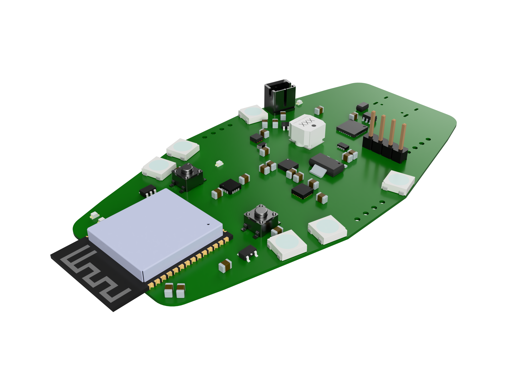
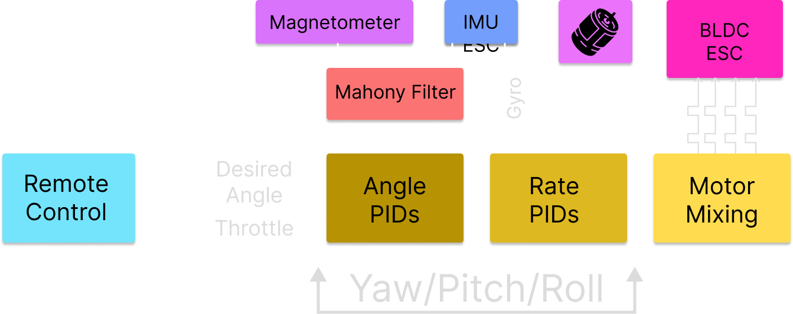
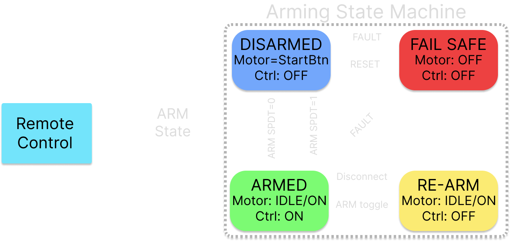

*
 Minh Do, Caleb Garcia, Chloe Fulbrook, Ethan Sam | April 7, 2026 
*

# Avionics / Flight Controller Board
### *Specific Dynamics - F17 Humanitarian Hummingbird*

## Revision Notes
-   ESP-NOW channel **must match the transmitter** (hardcoded, no scan). A mismatch looks like a dead link with no error.
-   `sizeof(drone_packet_t)` must be **identical** on transmitter and receiver. A struct-layout mismatch fails every length check in the ISR and is otherwise very hard to diagnose; the receiver logs the size on boot for exactly this reason.
-   PID gains tuned on the dev board (different IMU, COTS ESC) **did not transfer** to the final hardware. Always retune on the production avionics + custom ESC stack.
-   The arm switch is **inverted on read** so the idle position is disarmed. This is a deliberate fail-safe for controller power loss; do not "fix" the inversion.
-   The board carries a **dual-IMU footprint** (IMU0 / IMU1) and an unpopulated **UWB (Qorvo DWM3000)** footprint. UWB was descoped; only the ICM-40609-D (IMU0) and MMC5983MA are populated on the final build.
-   The redundant raw-7.4 V input is for **standalone bench bring-up only** (used during early dev with a COTS ESC). In the assembled drone, 3.3 V comes from the ESC board.

## Overview
The avionics board is the flight controller of the drone. It receives pilot setpoints over the ESP-NOW wireless link, fuses inertial and magnetic data into an attitude estimate, runs a cascaded PID stabilization loop at 1 kHz, and outputs four 50 Hz PWM throttle commands to the ESC board below. It stacks on top of the ESC/airframe board and is soft-mounted on rubber dampeners for vibration isolation of the inertial sensors.

The board is built around an Espressif ESP32-S3 running the ESP-IDF framework. Three concerns run concurrently as FreeRTOS tasks: ESP-NOW receive/validation, the cascaded PID control loop, and failsafe management.

*Avionics / Flight Controller board hardware block diagram*

---

## Hardware

### Component Selection
- Microcontroller / radio: **ESP32-S3-WROOM-1-N16** module (onboard 2.4 GHz PCB trace antenna), [Digikey](https://www.digikey.ca/); runs ESP-IDF, dual-core, 16 MB flash.
- IMU: **TDK InvenSense ICM-40609-D** 6-axis MEMS (3-axis gyro + 3-axis accel), SPI.
- Magnetometer: **MEMSIC MMC5983MA** 3-axis magnetic sensor, SPI.
- USB-to-UART bridge: **CP2102N-A02-GQFN28** (for the in-house auto-programming circuit).
- 3.3 V regulation: **TPS563209DDCR** and **TLV62085RLTR** buck converters; **LD1117S18CTR** 1.8 V LDO.
- Power ORing: **LM66200DRLR** ideal diode.
- Protection / logic: **USBLC6-2SC6** USB ESD, **SN74AHCT1G125DBVR** single-gate level shifters (×2).

Board-level BOM is approximately **\$52.83** across **42 line items / 80 components** (see the Design Specification, Appendix III).

### Microcontroller (ESP32-S3)
The **ESP32-S3-WROOM-1-N16** was selected for its powerful dual-core CPU, generous peripheral set, and built-in 2.4 GHz radio, which lets the PID loop and the ESP-NOW link run on the same chip without an external radio module. The module outputs four PWM motor command signals to the ESC board and runs the Espressif ESP-IDF framework. It is an off-the-shelf module integrated onto the team's custom board.

### Inertial Sensors (IMU + Magnetometer)
Two sensors close the control feedback path, both on a shared SPI bus with separate chip-select lines:

- **ICM-40609-D (IMU):** the gyroscope provides angular-rate measurements consumed directly by the PID inner rate loops; the accelerometer provides gravity-referenced tilt fused by the Mahony filter for the outer angle loops.
- **MMC5983MA (magnetometer):** provides an absolute heading reference for the yaw axis, preventing gyroscope-only yaw drift over time. Magnetometer data is only integrated into the attitude estimate when the measured field magnitude is within a band around the local field, so motor-induced magnetic noise does not corrupt heading.

Both sensors are off-the-shelf ICs integrated onto the team's custom board. The board also provides a second IMU footprint (IMU1) for optional redundancy; it is unpopulated on the final build.

### Power Architecture
In the assembled drone the board receives a regulated **3.3 V** rail from the ESC board through the board-to-board wiring, which powers the ESP32-S3, both inertial sensors, and all on-board logic. The board additionally includes **redundant power circuitry** capable of accepting the raw **7.4 V** bus directly through an onboard buck regulator and an ORing ideal diode. This path was used during early development when the avionics board was tested independently with a commercial off-the-shelf ESC, and is not the primary supply in the integrated aircraft.

### Programming / Debug
A **UART-based auto-programming circuit** (designed in-house, built around the CP2102N USB-UART bridge) allows firmware flashing over USB-C without manual boot-mode button sequences. Reset and Boot buttons, power-indicator LEDs, and a screen/debug header are also provided.

### PCB
The avionics PCB was designed in **Altium Designer** and manufactured by **JLCPCB**. It measures **46 mm × 85.7 mm** and uses a **4-layer stack-up** with inner ground and power planes providing noise isolation between the sensitive inertial sensors and the digital logic.

The design went through two iterations. The first was a development board that used a different IMU (the ICM-20648, a wearables part) and included extended wing sections that allowed motors to be mounted directly on the avionics board for preliminary PID work before the ESC/airframe board existed. The second and final iteration removed the wings (the board now stacks on the ESC/airframe board, which carries the motors) and incorporated the final sensor suite (ICM-40609-D + MMC5983MA).

<!-- TODO: replace placeholder below with the flight control board render. Save the file as pics/flight-controller-render.png (or update the path/extension to match). -->

*Flight control board render*

### Board-to-Board Interface
Soldered wire connections to the ESC board carry the **3.3 V** supply and ground on the power side, and **four PWM output lines** from the ESP32-S3 to the ESC board's STM32F405 on the signal side.

---

## Firmware

The avionics firmware is two cooperating subsystems on one ESP32-S3: the **receiver / comms** stack that turns ESP-NOW packets into validated, safe setpoints, and the **PID** stack that turns setpoints plus sensor data into motor commands. Sensor acquisition runs in dedicated lightweight tasks.

*Flight controller firmware: sensor fusion through cascaded PID to motor mixing*

### Receiver / Comms (ESP-NOW)
The receiver forms the drone-side half of the control link. Its job is to accept ESP-NOW packets from the handheld transmitter, validate them, translate stick deflections into physical setpoints, and hand those setpoints to the PID loop in a form that is guaranteed safe to act on.

**System Initialization.** `comms_wifi_init()` initializes the network layer, the default event loop, and Wi-Fi in station mode with RAM-only storage, then locks the radio to a fixed channel that must match the sender. `comms_init()` stores the handle of the downstream `controller_queue` (owned by the PID task), reads and logs the device MAC for pairing, creates the single-shot ISR-to-task queue, registers the ESP-NOW receive callback, and spawns three worker tasks. It also logs `sizeof(drone_packet_t)` so any struct-layout mismatch between sender and receiver is immediately visible.

**ESP-NOW Receive Callback.** Runs in the Wi-Fi driver task context (ISR priority) and is kept deliberately short. It rejects any frame whose length does not match `sizeof(drone_packet_t)`, then branches on packet type. Sync packets (`PKT_TYPE_SYNC`) are handled entirely in the callback: the receiver subtracts the sender's timestamp from its own `esp_timer_get_time()` value to learn the clock offset, stores it under the spinlock, and sets `has_offset`. Control packets are copied into the single-slot RX queue with `xQueueOverwriteFromISR()`, so the freshest packet always exists and a slow consumer can never build a backlog.

**RX Task** (priority 4). First "real" code to touch a packet; three jobs:
- *Latency:* uses the sync-derived clock offset to translate the sender's transmit timestamp into the receiver clock domain and compute true end-to-end delay. Packets older than `MAX_ALLOWED_LATENCY_US` are dropped. Before the first sync packet, this gate is bypassed so the link can come up.
- *Sequence:* wrap-safe unsigned-16-bit subtraction against the previous sequence number. A change of zero is a duplicate (dropped); greater than 32768 is out-of-order or rolled back (dropped); greater than one means packets were lost in flight (the missing count is added to a running counter).
- *Statistics:* min/max/sum/count of latency plus a jitter estimator (EWMA over the absolute first difference of latency).

On pass, the packet is copied into the shared `latest_rx_pkt`, the last-receive timestamp is updated, and `has_rx` is set. All shared-state writes happen under `rx_mux`, a `portMUX_TYPE` spinlock, because the same fields are touched from the Wi-Fi ISR context.

**Controller Task** (priority 3, 50 Hz). Converts validated wire packets into safe setpoints. It snapshots `latest_rx_pkt` and the last-receive tick under the spinlock, then scales the wire values into physical units:

| Wire value | Scaled to | Mode |
|---|---|---|
| Throttle | 0 to 100 % (unchanged) | motor percent |
| Pitch | ±100 → ±30° | angle setpoint |
| Roll | ±100 → ±30° | angle setpoint |
| Yaw | ±100 → ±200°/s | rate setpoint |

These limits are the hard envelope the pilot can command; tightening them is the simplest way to make the aircraft tamer. After the arming-state update, the task constructs a `safe_ctrl` copy of the setpoints and zeros throttle, yaw, pitch, and roll whenever the state is anything other than `STATE_ARMED`. The sanitized struct is pushed into `controller_queue` with `xQueueOverwrite()`, so the PID always sees the freshest setpoint and never a stale queued one.

**Arming State Machine** (four states):

*Receiver arming state machine*

- `STATE_DISARMED`: power-on state. Enters `STATE_ARMED` only after a rising edge on the arm switch while throttle is below 1 % and at least `MIN_GOOD_PACKETS` consecutive packets have satisfied that condition. This prevents accidental arm-on-power-up.
- `STATE_ARMED`: the only state in which stick inputs reach the PID. A falling edge on the arm switch returns to `STATE_DISARMED`.
- `STATE_FAILSAFE`: forced when a heartbeat is older than `FAILSAFE_TIMEOUT` (about 1 s). It cannot be exited just by restoring the link; the operator must first toggle the arm switch off, moving the system to `STATE_WAIT_FOR_REARM`.
- `STATE_WAIT_FOR_REARM`: a fresh rising edge with low throttle is required to rearm. Recovery is deliberately a two-step manual action so a momentarily-lost-then-recovered link cannot spontaneously start the motors.

**Stats Task** (priority 1, 1 Hz). Snapshots the link-quality counters under the spinlock and computes packet-loss percentage and average latency. Logging is currently commented out for the final stages, but the snapshot is cheap and gives a single place to publish telemetry. Loss is computed as `missed / (received + missed)` rather than as a sequence-number delta, which keeps the math correct across sequence wraps.

**Shared State and Concurrency.** Three execution contexts touch the same data: the Wi-Fi ISR (receive callback), the RX task, and the controller/stats tasks. Coordination uses a single `portMUX_TYPE` spinlock, `rx_mux`, protecting `latest_rx_pkt`, `last_rx_time`, `has_rx`, the clock offset, and all link-quality counters. A spinlock rather than a mutex is used because one writer is an ISR and ISRs cannot block. Two single-slot queues handle the data path: `rx_transmit_queue` (ISR to RX task) and `controller_queue` (controller task to PID task), both with overwrite semantics, which is the right choice for a real-time control stream.

### PID Control (cascaded)
The PID block takes the sanitized setpoints from the comms layer and the drone's measured attitude and rates, and computes the per-motor outputs that drive the drone toward those setpoints. It is a **cascaded** loop: an outer **angle** loop for pitch and roll produces rate targets, feeding an inner **rate** loop that runs on all three axes and produces torque commands. Throttle is mixed in at the final motor-mixing stage. Yaw does not use the cascaded architecture; it is a rate loop only, so the aircraft holds whatever heading the pilot leaves it in.

**Initialization.** GPIO and semaphore setup; SPI configured for the magnetometer and IMU; magnetometer and IMU registers configured to enable outputs, set device configuration and filtering, and characterize device behaviour; the Mahony filter is initialized to the IMU output data rate; PID structures are initialized to the tuned parameters; motor initialization with limiting applied for uniform thrust across motors; the controller protocol is initialized; magnetometer and IMU polling tasks are created alongside the main control task.

**Main PID Task.** A single `pid_task` on the ESP32-S3. It receives data from the magnetometer, IMU, and controller through lightweight dedicated tasks polling interrupt pins and initiating SPI transactions on data availability (`imu_task` + `imu_gpio_isr_handler`, and `magnetometer_task`). IMU and magnetometer axes are rebased in the control loop to unify the aircraft sensor axes and account for the physical sensor orientations. Offsets and corrections remove sensor biases. The magnetometer output magnitude is continuously compared to the local field magnitude to schedule magnetometer integration into the Mahony filter only when magnetic noise is low and within a band around the local field. The Mahony filter then derives attitude with respect to the magnetic and gravitational references. The cascaded PID architecture and motor mixing are applied before output as PWM. Conditioning enforces the controller states and prevents unwanted motor behaviour. The implementation includes a **feedforward** term for responsiveness, plus anti-windup, derivative-persistence handling, and output limiting so the motors stay within the ESC's operable range.

**PID Tuning.** Tuning followed a Ziegler-Nichols-inspired heuristic, refined empirically in flight. Order of operations: tune the inner-loop proportional terms first (rapid response to gyro-rate changes without oscillation), then the outer-loop proportional terms, then add a small derivative term on the inner rate loops in live testing (starting at one-fortieth of the inner-loop proportional terms; the outer loops use no derivative), then tune the feedforward terms until stick movements are responsive without overwhelming the PID stabilization. Integral tuning was left unimplemented because the steady-state error was acceptable in operation. The final parameters are sufficient for stable hover and movement and may be improved:

| Loop | Kp | Ki | Kd | Kf |
|---|---|---|---|---|
| Pitch Angle | 6.0 | 0.0 | 0.0 | 0.0 |
| Pitch Rate | 4.0 | 0.0 | 0.05 | 0.5 |
| Roll Angle | 6.0 | 0.0 | 0.0 | 0.0 |
| Roll Rate | 2.0 | 0.0 | 0.05 | 0.5 |
| Yaw Rate | 0.3 | 0.0 | 0.015 | 0.2 |

### PWM Motor Output
Each motor output is a standard RC servo signal: **1000 to 2000 µs pulse width at 50 Hz**, on four channels. The 50 Hz rate was chosen because the drone is a mechanically slow system that reacts gradually to disturbances, so a faster servo frame rate would not improve control. The ESP32-S3's dual-core CPU and peripheral set comfortably support generating four PWM channels alongside the PID and communications workloads.

---

## Tuning Notes
- **Command envelope:** the safest way to make the aircraft less aggressive is to tighten the controller-task scaling limits (±30° angle, ±200°/s yaw) rather than detuning the PID.
- **Magnetometer gating band:** widen or narrow the local-field acceptance band if yaw drifts (band too tight rejects good data) or wanders under throttle (band too loose admits motor noise).
- **Failsafe timeout:** `FAILSAFE_TIMEOUT` (~1 s) trades link-dropout tolerance against how quickly the aircraft cuts motors on a true loss of link.
- **Arming gate:** `MIN_GOOD_PACKETS` and the <1 % throttle requirement set how strict arm-on is; loosening them speeds arming at the cost of accidental-arm protection.
- **Retune on real hardware:** dev-board gains do not transfer. Treat any PID values obtained on a surrogate (different IMU or COTS ESC) as a starting point only.

---

## Glossary

| Term | Definition |
|------|------------|
| **Attitude** | The drone's orientation (roll, pitch, yaw) relative to the gravitational and magnetic references. |
| **Cascaded PID** | A two-level controller where an outer loop (angle) generates the setpoint for an inner loop (rate). The inner loop runs faster and rejects disturbances; the outer loop tracks the commanded angle. |
| **EWMA** | Exponentially Weighted Moving Average. A cheap running statistic that weights recent samples more heavily; used here for the jitter estimate. |
| **ESP-IDF** | Espressif IoT Development Framework. The official C SDK and FreeRTOS-based runtime for ESP32 devices. |
| **ESP-NOW** | A connectionless Espressif 2.4 GHz peer-to-peer protocol that needs no router or access point; used for the controller-to-drone link. |
| **Feedforward (Kf)** | A control term that injects a fraction of the commanded input directly into the output, bypassing the feedback path, to improve responsiveness to fast stick movements. |
| **Heartbeat** | The continuous arrival of valid control packets. A stale heartbeat (older than the failsafe timeout) triggers `STATE_FAILSAFE`. |
| **IMU** | Inertial Measurement Unit. Here a 6-axis MEMS device providing 3-axis gyroscope (angular rate) and 3-axis accelerometer (linear acceleration / gravity reference) data. |
| **ISR** | Interrupt Service Routine. Code that runs in response to a hardware event; the ESP-NOW receive callback runs at ISR priority and so cannot block. |
| **Mahony filter** | A nonlinear complementary attitude filter that fuses gyro, accelerometer, and (gated) magnetometer data into an orientation estimate without the cost of a full Kalman filter. |
| **MCU** | Microcontroller Unit. Here the Espressif ESP32-S3 dual-core SoC running the flight firmware. |
| **NVS** | Non-Volatile Storage. ESP-IDF key-value flash storage (used here only on the transmitter for calibration; the receiver uses RAM-only Wi-Fi storage). |
| **portMUX / spinlock** | A FreeRTOS-on-ESP busy-wait lock safe to take from an ISR (unlike a mutex, which can block). Protects state shared between the Wi-Fi ISR and tasks. |
| **PWM** | Pulse Width Modulation. The 1000–2000 µs / 50 Hz servo signal used to command each motor's throttle to the ESC. |
| **Rate loop** | The inner PID loop operating on angular velocity (°/s) from the gyroscope. |
| **Setpoint** | The commanded target the PID drives toward (an angle for pitch/roll, a rate for yaw, a percent for throttle). |
| **SPI** | Serial Peripheral Interface. The synchronous serial bus used to read the IMU and magnetometer (shared bus, separate chip-select lines). |
| **xQueueOverwrite** | A FreeRTOS single-slot queue write that replaces the existing item, guaranteeing the consumer always reads the freshest value and never a backlog of stale ones. |
