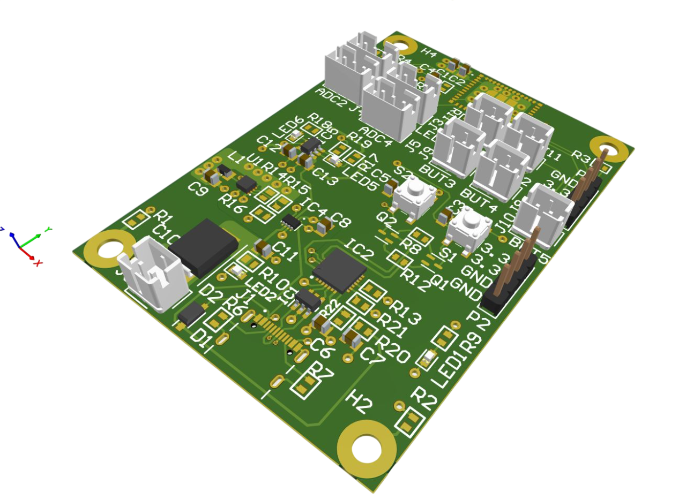
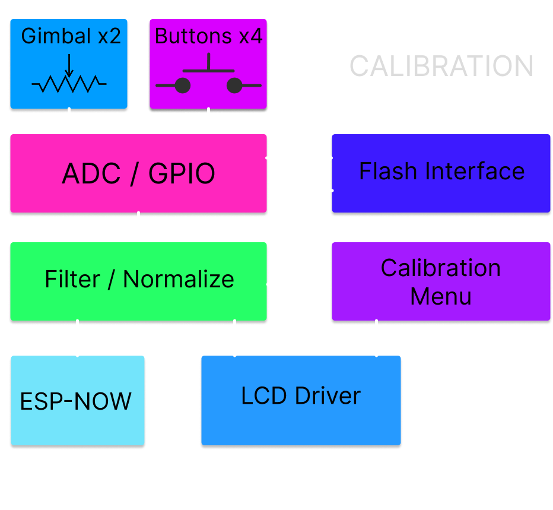

*
 Chloe Fulbrook, Ethan Sam, Minh Do | April 7, 2026 
*

# Handheld Controller Board
### *Specific Dynamics - F17 Humanitarian Hummingbird*

## Revision Notes
-   The receiver MAC address and Wi-Fi channel are **hardcoded**. They must match the drone's flight controller, and ESP-NOW runs **unencrypted** (a deliberate latency-over-security tradeoff for a short-range control link).
-   The arm switch is **inverted on read** so the idle ("up") position is disarmed. This is a safety feature for controller power loss; do not "fix" the inversion. Throttle is *also* forced to zero in the packet whenever disarmed, as defense in depth.
-   Gimbals are recycled potentiometers from an **IDEAFLY MC6** controller; their mechanical centre is not the electrical midpoint, so **calibration is mandatory**. Calibration is stored in the `joystick` NVS namespace; corrupt or absent NVS falls back to a sane 12-bit default.
-   The 100 Hz input/control rate is limited by the ESP32-C3's default clock speed. The sub-10 ms end-to-end response depends on the RTOS priority layering, not on raw loop speed.
-   The PCB was completed in a **single iteration with no respins**.
-   Items still marked TBD in the source design specification: OLED screen contents, 1S LiPo battery capacity (mAh), and final board dimensions. Confirm before publishing externally.

## Overview
The handheld controller is the pilot interface for manual flight. It reads two dual-axis gimbals, four buttons, and an arm/disarm toggle, conditions and calibrates the stick signals, packetizes them, and transmits them to the drone over ESP-NOW at 100 Hz. It is a physically independent unit with its own 1S LiPo battery and USB-C charging.

The controller is built around an Espressif ESP32-C3-Mini running ESP-IDF. The transmitter firmware is a set of cooperating FreeRTOS tasks that sample, condition, packetize, and transmit pilot input at a fixed rate, with supporting subsystems for joystick calibration, persistent storage, on-screen feedback, and link-health monitoring.

*Handheld controller hardware block diagram*

---

## Hardware

### Component Selection
- Microcontroller / radio: **ESP32-C3-MINI-1-N4** module (onboard 2.4 GHz PCB trace antenna); runs ESP-IDF.
- Pilot input: two potentiometer **gimbals** harvested from an IDEAFLY MC6 controller (4 analog axes: throttle, yaw, pitch, roll), each on a JST connector.
- Display: 0.96-inch monochrome **OLED**, 96 × 64 px, I²C (SSD1306-class).
- USB-to-UART bridge: **CP2102N-A02-GQFN28** (auto-programming over USB-C).
- Battery charge IC: **TP4057-42-SOT26-R** (1S Li-ion / LiPo linear charger).
- 3.3 V regulation: **TLV62085RLTR** buck converter.
- Power ORing / protection: **LM66200DRLR** ideal diode, **B540C** and **1N5819HW** Schottky diodes, **USBLC6-2SC6** USB ESD, **USB4105-GF-A** USB-C receptacle.

Board-level BOM is approximately **\$28.44** across **37 line items / 61 components** (see the Design Specification, Appendix III).

### Microcontroller (ESP32-C3)
The **ESP32-C3-Mini** reads the joystick ADC inputs, drives the OLED over I²C, reads the button and switch GPIO inputs, and transmits ESP-NOW control packets to the drone at **100 Hz** through its onboard 2.4 GHz PCB trace antenna. The antenna is oriented vertically when the controller is held in the normal operating position, maximizing radiation-pattern coverage toward the drone. It is an off-the-shelf module integrated onto the team's custom board.

### Pilot Input (Gimbals, Buttons, Switch)
Pilot input is provided by two potentiometer-based gimbals harvested from an **IDEAFLY MC6** controller, giving four analog axes (throttle, yaw, pitch, roll). Each gimbal connects to the controller PCB via a JST connector and is read by the ESP32-C3's 12-bit ADC. The firmware applies IIR low-pass filtering, calibration, normalization to a signed 100-point range, and a deadband of three counts to eliminate stick drift near centre.

Four panel-mounted push buttons and a single-throw arm/disarm toggle switch are read as GPIO inputs with internal pull-ups (so they read high when idle). The arm switch requires a deliberate physical action to enable motor output and serves as a hardware safety interlock. The gimbals, buttons, and switch are all off-the-shelf components.

### Display
A 0.96-inch monochrome OLED (96 × 64 px) on the I²C bus provides real-time status feedback to the pilot. (The exact on-screen layout is marked TBD in the design specification; the firmware logs stick values and arming state to it, and the calibration routine takes over the display while it runs.)

### Power and Charging
The controller runs from a single-cell LiPo battery. Charging is provided through a USB-C port connected to a dedicated charge-management IC (**TP4057**) on the controller PCB, and a voltage-regulation stage (**TLV62085RLTR**) provides the regulated 3.3 V supply for the ESP32-C3 and peripherals. The charge circuit and voltage regulation were designed in-house using off-the-shelf ICs. (Battery capacity is marked TBD in the source specification.)

### Programming / Debug
A USB-C connected **CP2102N** USB-UART bridge with an auto-programming circuit allows firmware flashing without manual boot-mode button sequences. USB ESD protection (USBLC6-2SC6) and reverse-polarity / ORing protection are included on the USB and battery inputs.

### PCB
The handheld controller PCB was designed in **Altium Designer** by Minh Do, with the schematic developed jointly by Minh Do and Ethan Sam, and manufactured by **JLCPCB**. It integrates the ESP32-C3-Mini module, JST connectors for all peripherals (dual-stick gimbals, four panel-mounted buttons, arm/disarm toggle, 0.96-inch OLED), a USB-C charging circuit with dedicated charge-management IC, and a 1S LiPo voltage-regulation stage. It uses a **4-layer stack-up** with inner ground and power planes for noise isolation and clean ADC routing from the joystick gimbals. The design was completed in a single iteration with no respins. (Final board dimensions are marked TBD in the design specification.)

### Enclosure
The handheld controller enclosure is a two-piece 3D-printed shell in PLA Pro that houses the controller PCB, dual-stick gimbals, 1S LiPo battery, and OLED display. The PCB mounts to screw-in standoffs inside the enclosure. The shell includes cutouts for the four panel-mounted push buttons, the arm/disarm toggle switch, the USB-C charging port, and the display window. It was designed to be ergonomic for a two-handed grip during flight operation.

<!-- TODO: replace placeholder below with the controller enclosure render. Save the file as pics/controller-enclosure-render.png (or update the path/extension to match). -->

*Controller enclosure render*

---

## Firmware

The transmitter firmware turns physical pilot inputs into a stream of control packets transmitted to the drone over ESP-NOW. The blocks below follow the data path from raw ADC sample to over-the-air packet.

*Handheld controller transmitter firmware block diagram*

### System Initialization
On power-up, `app_main_sender()` brings up hardware and software in a fixed order. NVS is initialized first, as it is used by both the Wi-Fi stack and the joystick calibration loader. Wi-Fi is started in station mode and ESP-NOW is initialized afterwards. The receiver ESP's MAC address is registered as a peer on a fixed channel with no encryption, keeping latency low at the cost of security (a reasonable tradeoff for a short-range control link). The four joystick ADC channels are configured through the ESP-IDF one-shot ADC driver, and the UI GPIOs are configured as inputs with internal pull-ups. The I²C bus and SSD1306 OLED are initialized last, after which a greeting message confirms the display is alive. Finally, a previously saved calibration is loaded from NVS; if none exists, a sane 12-bit default is loaded so the controller is usable on first boot.

### Input Acquisition
`input_task()` is the entry point for all user input. It runs on a fixed 10 ms period using `vTaskDelayUntil()`, giving a nominal 100 Hz sample rate (limited by the ESP32-C3 default clock). Each cycle it samples all four joystick axes. The arming switch is inverted on read so the "up" idle position corresponds to disarmed, implementing a safety feature for the case where the controller loses power. The task also implements a press-and-hold state machine on the calibration button: if it is held longer than `CALI_HOLD_TIME` (two seconds) while disarmed, the global `system_mode` transitions to `MODE_CALIBRATE` and the calibration task is notified. While calibrating, `input_task()` idles so it does not fight the calibration routine for the ADC.

### Signal Processing
Raw ADC samples are noisy and uncentered, so they pass through three conditioning stages before becoming control values:
1. A first-order IIR low-pass filter (alpha 0.15) smooths high-frequency jitter from the ADC and mechanical stick vibration. The small alpha trades a little responsiveness for a much cleaner signal.
2. `normalize_axis_calibrated()` maps the filtered value into a meaningful range using the stored calibration. Throttle is unipolar (0 to 100); yaw, pitch, and roll are bipolar (-100 to 100) using two separate linear segments (min-mid and mid-max) so a stick whose mechanical centre is not exactly halfway is still mapped correctly. Both branches clamp against overshoot.
3. `apply_deadband()` zeros any bipolar value within ±3 of centre, eliminating twitch when the sticks are untouched.

The conditioned values are written into the shared `curr_inputs` struct for the control task to consume.

### Calibration Subsystem
Calibration exists because no two joysticks share the same electrical centre or travel range, and these values drift over time. `calibrate_joysticks()` walks the user through each axis (low, centre, high), capturing an ADC reading at each step on a button press with debounce and a wait-for-release so one press cannot advance two steps. The wrapper task `joystick_calibration_task()` blocks on `ulTaskNotifyTake()` and only runs the routine when `input_task()` notifies it, then persists the new calibration and returns to `MODE_CONTROL`. `save_cali_nvs()` / `load_cali_nvs()` store the entire `axis_calibration_t` struct as a single blob under the `joystick` NVS namespace. `set_default_calibration()` provides the fallback used on first boot or if NVS is corrupt.

### Control and Packetization
`control_task()` is the bridge between user intent and the ESP-NOW link. Running at 100 Hz, it copies the conditioned values from `curr_inputs` into a `drone_packet_t`, tags it as `PKT_TYPE_CTRL`, and stamps it with a monotonically increasing sequence number and a microsecond-resolution timestamp from `esp_timer_get_time()`. The sequence number lets the receiver detect dropped or reordered packets, and the transmit timestamp lets it compute end-to-end latency once the clocks are synchronized. The task enforces a critical safety rule: **if the arm switch is not engaged, throttle is forced to zero before the packet leaves the controller**, so a disarmed controller cannot command motor output even if downstream code misbehaves. The completed packet is pushed into both `transmit_queue` and `oled_update_queue` using `xQueueOverwrite()`, which keeps only the most recent packet, the desired behaviour for a real-time control stream.

### Communication and Transmission
Two tasks and one callback handle the radio. `transmit_task()` blocks on `transmit_queue` and forwards each control packet over ESP-NOW; the blocking receive means the task uses essentially no CPU when idle. `esp_now_sync_task()` emits a dedicated `PKT_TYPE_SYNC` packet every 500 ms carrying its own transmission timestamp, so the receiver can maintain a running estimate of the clock offset between the two devices. The send callback `esp_now_send_cb` is invoked after every transmission attempt; it counts consecutive failures and raises a `link_warning` flag once the count crosses `PACKET_LOSS_WARNING_THRESHOLD`, giving the rest of the system a single boolean to react to link degradation.

### User Feedback and OLED
`oled_update_task()` is the user-facing output during normal operation. It pulls the latest packet from `oled_update_queue` and, every half second, logs the current stick values and arming state. The half-second cadence exists because the screen and ESP logging cannot keep up with the 100 Hz control loop, and a human cannot read faster than that anyway. The task suspends OLED writes whenever `system_mode` is `MODE_CALIBRATE`, so the calibration routine has exclusive use of the display.

### System State Management
A small state machine in the global `system_mode` variable coordinates the tasks. `MODE_CONTROL` is the normal flight state in which the input, control, transmit, and OLED tasks all run. `MODE_CALIBRATE` is entered by the long-press of the calibration button while disarmed, and causes `input_task()` and `oled_update_task()` to step aside so the calibration task owns the ADC and screen. Centralizing the mode in one variable keeps inter-task coordination simple: each task just checks the mode at the top of its loop.

### RTOS Scheduling
Task priorities reflect real-time importance: `transmit_task()` is highest (priority 4) because a delayed packet directly increases control latency; `input_task()` and `control_task()` sit at priority 3 since they feed the transmitter; the calibration and sync tasks run at priority 2; the OLED task at priority 1; and an idle task at priority 0. Inter-task communication uses two single-slot overwrite queues for the control stream, task notifications for the lightweight `input_task()` to `joystick_calibration_task()` handoff, and shared volatile structs (`curr_inputs`, `system_mode`) for state read far more often than written. This layering of faster producers, prioritized consumers, and a clear data/control path split is what holds the controller to a consistent sub-10 ms end-to-end response.

---

## Tuning Notes
- **Filter responsiveness:** the IIR alpha (0.15) trades stick responsiveness against noise. Raise it for snappier sticks at the cost of jitter; lower it for smoother but laggier input.
- **Deadband:** the ±3-count deadband removes centre twitch. Widen it if worn pots still drift at centre; narrow it for finer centre control.
- **Calibration:** always recalibrate after swapping gimbals or if centre/end behaviour feels off. Calibration persists across power cycles in NVS.
- **Link warning threshold:** `PACKET_LOSS_WARNING_THRESHOLD` sets how many consecutive failed transmissions raise `link_warning`. Lower it for earlier warning, raise it to suppress spurious warnings on a marginal link.
- **Channel / MAC:** the fixed channel and peer MAC must match the drone receiver exactly; a mismatch presents as a silent dead link.

---

## Glossary

| Term | Definition |
|------|------------|
| **ADC** | Analog-to-Digital Converter. The ESP32-C3's 12-bit ADC reads the analog gimbal potentiometer voltages. |
| **Deadband** | A small range around stick centre that is forced to zero, so a stationary or slightly worn stick reads as no input. |
| **ESP-IDF** | Espressif IoT Development Framework. The official C SDK and FreeRTOS-based runtime for ESP32 devices. |
| **ESP-NOW** | A connectionless Espressif 2.4 GHz peer-to-peer protocol needing no router or access point; used for the controller-to-drone link. |
| **FreeRTOS** | The real-time operating system underlying ESP-IDF; provides tasks, queues, notifications, and priority scheduling. |
| **Gimbal** | A spring-centred two-axis joystick mechanism; here, potentiometer-based units recycled from an IDEAFLY MC6 transmitter. |
| **IIR filter** | Infinite Impulse Response filter. A lightweight recursive low-pass (`filtered += alpha * (raw - filtered)`) used to smooth ADC noise. |
| **I²C** | Inter-Integrated Circuit. The two-wire serial bus driving the OLED display. |
| **MAC address** | The unique radio identifier; the transmitter registers the receiver's MAC as a fixed ESP-NOW peer for pairing. |
| **NVS** | Non-Volatile Storage. ESP-IDF key-value flash storage; here it persists the joystick calibration blob. |
| **OLED** | Organic LED display. The 0.96-inch 96 × 64 monochrome status screen on the I²C bus. |
| **Packet (`drone_packet_t`)** | The fixed-layout control or sync message sent over ESP-NOW; its size must match on both ends. |
| **Sequence number** | A monotonically increasing per-packet counter the receiver uses to detect dropped or reordered packets. |
| **Sync packet** | A periodic `PKT_TYPE_SYNC` message carrying a transmit timestamp, used by the receiver to estimate the clock offset for true latency measurement. |
| **xQueueOverwrite** | A FreeRTOS single-slot queue write that replaces the existing item, so the consumer always gets the freshest value and never a stale backlog. |
