<div align="center">


# F-17 Humanitarian Hummingbird

**A sub-250 g modular microdrone where the PCB *is* the airframe.**

Specific Dynamics &nbsp;·&nbsp; Hood Research Department &nbsp;·&nbsp; ENEL 400, Schulich School of Engineering &nbsp;·&nbsp; January – April 2026

</div>

---

## Table of Contents

- [Overview](#overview)
- [Highlights](#highlights)
- [System Architecture](#system-architecture)
- [Repository Layout](#repository-layout)
- [Subsystems](#subsystems)
  - [1. ESC / Airframe Board](#1-esc--airframe-board)
  - [2. Avionics / Flight Controller Board](#2-avionics--flight-controller-board)
  - [3. Handheld Controller Board](#3-handheld-controller-board)
  - [4. Wireless Link (ESP-NOW)](#4-wireless-link-esp-now)
  - [5. Mechanical / Enclosure](#5-mechanical--enclosure)
- [Engineering Analysis](#engineering-analysis)
- [Testing & Results](#testing--results)
- [Bill of Materials](#bill-of-materials)
- [Design Alternatives Considered](#design-alternatives-considered)
- [Regulatory Considerations](#regulatory-considerations)
- [Future Work](#future-work)
- [Team](#team)
- [Acknowledgements](#acknowledgements)
- [References](#references)

---

## Overview

The **F-17 Humanitarian Hummingbird** is a lightweight, low-cost, fully modular quadrotor microdrone built as a proof of concept for general-purpose UAV applications such as aerial sensing, imaging, and small payload delivery. It targets a gap in the market: affordable commercial micro-drones generally ship as closed ecosystems with limited customisation and long lead times for purpose-built variants, and no affordable, hackable, sub-250 g modular platform was readily available.

The project's defining design choice is a **PCB-as-airframe** architecture: the electronic speed controller board doubles as the primary structural frame, eliminating a separate chassis and wiring harness. The system integrates three custom PCBs and a wireless control link, all designed and built from scratch:

- a custom **brushless DC motor controller (ESC)** running bare-metal C on an STM32F405,
- a **PID-stabilised flight controller** on an ESP32-S3 with 9-axis sensor fusion, and
- a handheld **ESP-NOW remote** on an ESP32-C3.

The complete aircraft weighs **145 g** as built and flown, well within the 250 g Transport Canada threshold for registration-exempt recreational operation.

<div align="center">
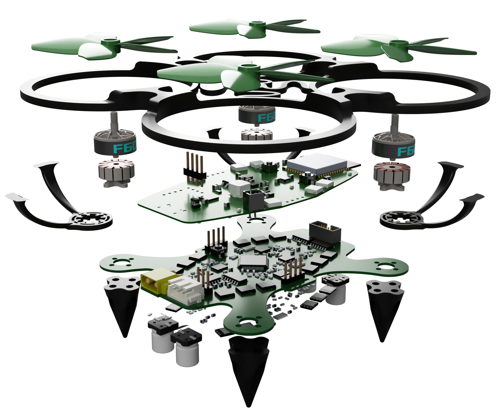
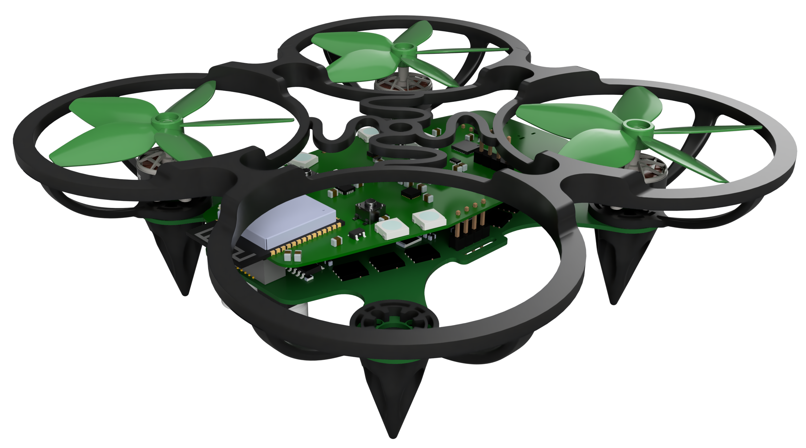
</div>

---

## Highlights

| Area | Result |
|---|---|
| **Mass** | 145 g as built and flown, 42 % under the 250 g regulatory limit |
| **Thrust-to-weight** | ≈ 2.3 : 1 (exceeds the 2 : 1 design target) |
| **Propulsion** | 4 × YSIDO 1104 8600 kV BLDC motors, 51 mm 5-blade props on a 2S LiPo |
| **ESC** | Custom 4-motor sensorless 6-step trapezoidal controller (STM32F405) |
| **Flight control** | Cascaded PID, 1 kHz loop, Mahony 9-axis fusion, 4-state failsafe |
| **Wireless** | ESP-NOW @ 2.4 GHz, 100 Hz control stream, > 20 m usable range |
| **Endurance** | ≈ 5.5 min hover (≈ 3× the 2 min requirement) |
| **Custom PCBs** | 7 boards designed; ESC, avionics, and handheld controller |
| **Firmware** | > 3000 lines of custom C across three microcontrollers |
| **Cost** | ≈ \$2,200 total R&D + final build (under the \$2,500 cap) |

---

## System Architecture

The aircraft is a **two-board stacked drone** with a physically separate handheld controller communicating over a wireless link.

<div align="center">
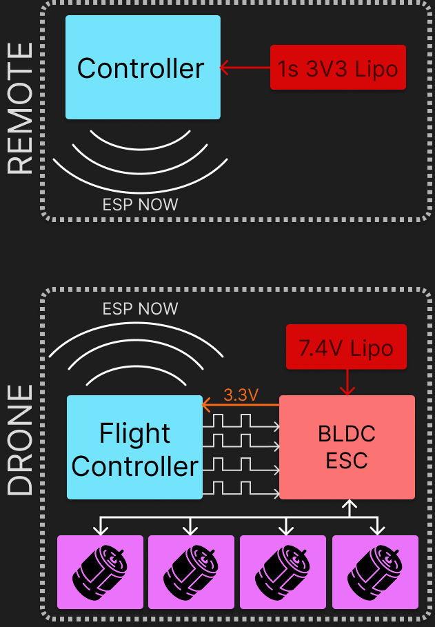
</div>

The signal path runs end to end as follows:

1. The pilot's joystick inputs are sampled, filtered, and packetised on the **handheld controller** (ESP32-C3).
2. Packets cross the **ESP-NOW** link (2.4 GHz, channel 1, hardcoded MAC pairing) to the drone's **flight controller** (ESP32-S3).
3. The flight controller runs the **cascaded PID loop**, closing the feedback path with the IMU and magnetometer, and emits four PWM motor commands.
4. The **ESC** (STM32F405) converts each PWM command into 6-step sensorless trapezoidal commutation, driving the four brushless motors.

Power originates from a 2S LiPo on the ESC/airframe board, which feeds the motor power stages directly and a buck converter that supplies a regulated 3.3 V rail to both boards. The handheld controller runs from its own independent 1S LiPo with USB-C charging.

---

## Repository Layout

This README is the top-level project document. Each subsystem has (or will have) its own README under its directory.

```
.
├── README.md                         ← this document (project overview)
├── pics/                             ← figures referenced by this README
├── docs/
│   ├── Design_Specification.pdf      ← full design specification (authoritative)
│   ├── Poster.pdf                    ← conference-style summary poster
│   └── Presentation.pptx             ← design review presentation
├── esc/
│   ├── hardware/                     ← ESC / airframe PCB (Altium)
│   │   └── README.md                 ← BLDC ESC hardware notes
│   └── firmware/                     ← STM32F405 bare-metal C firmware
│       └── README.md                 ← BLDC ESC firmware reference
├── avionics/                         ← flight controller PCB + ESP32-S3 firmware
│   └── README.md                     ← (to be added)
├── controller/                       ← handheld remote PCB + ESP32-C3 firmware
│   └── README.md                     ← (to be added)
└── mechanical/                       ← 3D models (legs, prop guards, controller shell)
    └── README.md                     ← (to be added)
```

> The ESC hardware and firmware READMEs already exist (provided as `BrushlessMotorHardwareREADME.md`
> and `BrushlessMotorFirmwareREADME.md`). The avionics, controller, and mechanical
> subsystems are documented in the design specification and will receive dedicated
> READMEs in a follow-up pass.

---

## Subsystems

### 1. ESC / Airframe Board

The ESC/airframe board carries the full power electronics, sensorless commutation logic, voltage regulation, **and** acts as the structural airframe of the drone.

<div align="center">
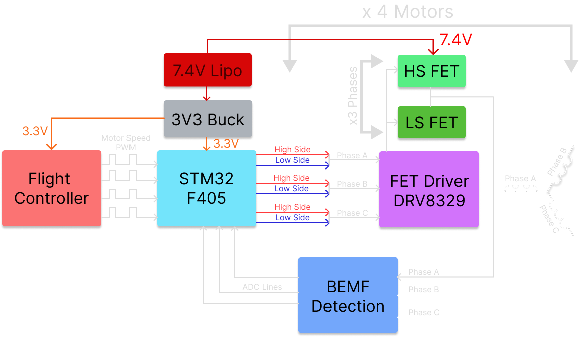
</div>

**Hardware**

| Block | Part | Notes |
|---|---|---|
| MCU | STM32F405RGT6 (Cortex-M4) | 168 MHz from 16 MHz HSE; 4 advanced timers, dual ADC |
| Gate driver | TI DRV8329BREER ×4 | One smart 3-phase gate driver per motor, 3-PWM mode |
| Power FETs | TI CSD17581Q5A ×24 | 30 V N-channel, three half-bridges per motor |
| Buck | TI TPS563209DDCR | 7.4 V → 3.3 V logic rail |
| Battery in | XT30, 2S LiPo (6.0–8.4 V) | GAONENG 1000 mAh 120C |
| BEMF sense | In-house network | 22 kΩ / 11 kΩ dividers + 2nd-order Sallen-Key LPFs, virtual-neutral reconstruction, 100 Ω ADC series protection |

The board is **87 mm × 87 mm, 6-layer**, partitioned into a central signal region (`signal–gnd–pwr–signal–gnd–signal` for integrity) and an outer power region (all layers paralleled for phase-current copper weight). It went through three iterations: two single-motor validation boards followed by the full four-motor airframe board. *(A MOSFET-orientation error on the first test board required a respin; see the schedule variance discussion in the design specification.)*

**Firmware** (bare-metal C, STM32 HAL)

All four motors run a sensorless **6-step trapezoidal commutation** scheme with BEMF zero-crossing detection. Each motor is governed by an independent state machine; motors are started in a staggered sequence to limit inrush current and ADC load.

<div align="center">
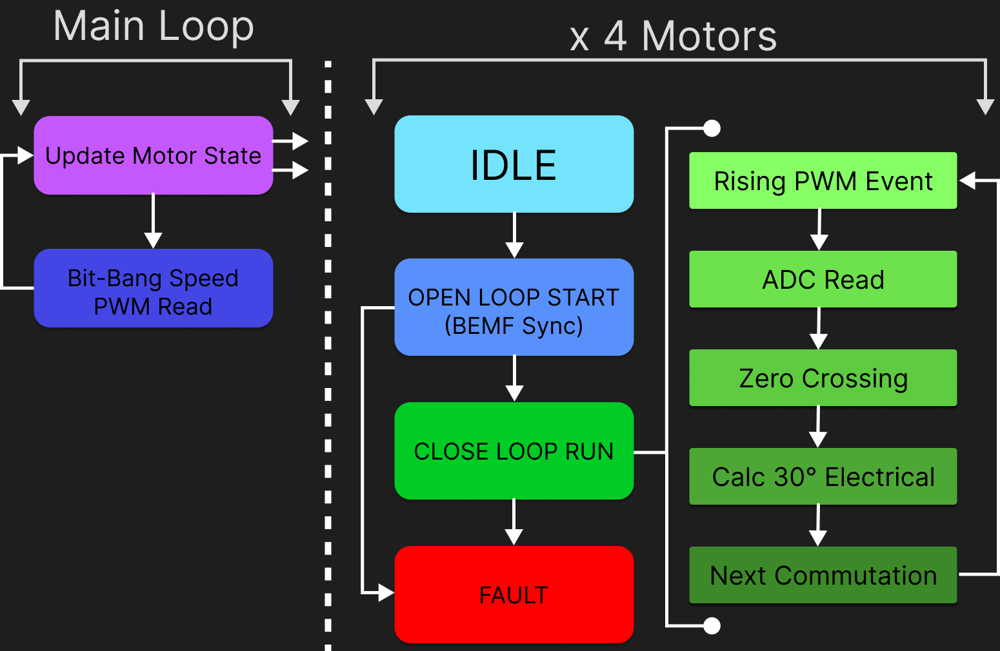
</div>

State machine: `IDLE → ALIGN → OPENLOOP_RUN → MOTOR_RUN → FAULT`

- **IDLE** — waiting for a valid PWM throttle (> 4.8 % duty / > 960 µs).
- **ALIGN** — Phase A energised ~100 ms to lock the rotor to a known position.
- **OPENLOOP_RUN** — fixed-timing ramp; step delay decreases geometrically (5000 µs → 240 µs, factor 0.997/step). Transitions to closed loop after the open-loop hold elapses **and** 12 consecutive valid zero crossings are observed.
- **MOTOR_RUN** — BEMF-driven closed loop; each ADC-detected zero crossing advances the step and updates the commutation period. A fallback timer commutates if no BEMF event arrives in time.
- **FAULT** — all gate drivers killed via `nSLEEP`; recovery only by MCU reset. Up to 5 automatic per-motor restarts are attempted first.

**Startup melody / audible POST.** On power-up, after the DRV8329 power-up delay and `nSLEEP` assertion, Motor 1 plays a short tune (the intro riff and first line of *Never Gonna Give You Up*, Rick Astley, 1987) by driving its commutation steps at audio frequencies before entering the throttle-waiting state. Beyond being a signature touch, it doubles as an audible power-on self-test: if the melody plays cleanly, the gate driver, phase outputs, and commutation path on at least one motor are confirmed working. `MELODY_Play()` is a blocking routine and runs only before the main control loop starts.

Key implementation details: three ADCs in injected mode triggered simultaneously at 52.5 kHz by `TIM1_TRGO`; BEMF processing deferred from ISR to the main loop; adaptive IIR filtering (heavy during sync, light during run); software dead-time insertion in addition to DRV8329 hardware dead-time; rate-based stall detection by counting fallback commutations. Full register, timer, and pin maps are in [`esc/firmware/README.md`](esc/firmware/README.md).

---

### 2. Avionics / Flight Controller Board

The avionics board houses the flight controller, inertial sensors, and wireless module. It stacks above the ESC board and is soft-mounted on rubber dampeners over nylon standoffs for vibration isolation.

<div align="center">
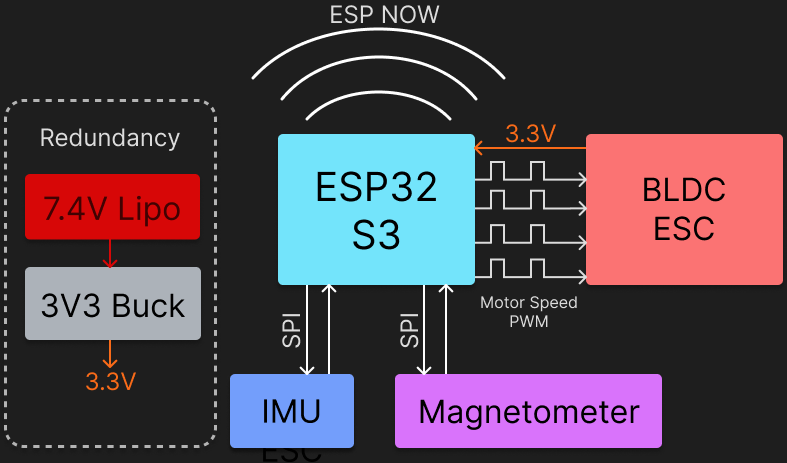
</div>

| Block | Part | Role |
|---|---|---|
| MCU / radio | Espressif ESP32-S3-WROOM (N16) | PID, ESP-NOW comms, failsafe; onboard PCB antenna |
| IMU | TDK InvenSense ICM-40609-D | 3-axis gyro + 3-axis accel over SPI |
| Magnetometer | MEMSIC MMC5983MA | Absolute yaw heading reference over SPI |
| Power | 3.3 V from ESC board | Redundant 7.4 V path for standalone bench testing |

The board is **46 mm × 85.7 mm, 4-layer** with inner ground/power planes for sensor noise isolation, and includes a UART auto-programming circuit so firmware can be flashed without manual boot-mode sequencing.

**Flight control firmware**

A **cascaded PID** architecture runs at a 1 kHz loop rate: an outer angle loop (pitch/roll) feeds an inner rate loop on all three axes; throttle is mixed at the final motor-mixing stage. Attitude is estimated by a **Mahony complementary filter** fusing gyro, accelerometer, and (opportunistically gated) magnetometer data. Yaw uses a rate loop rather than the cascaded angle structure so the aircraft holds whatever heading the pilot leaves it in.

<div align="center">
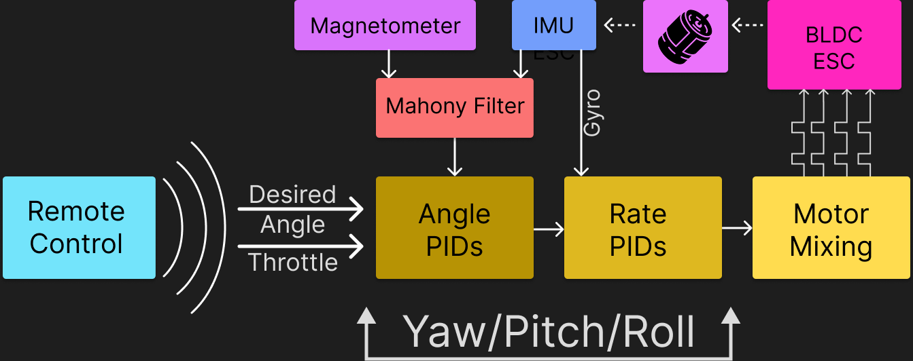
</div>

Tuning followed a Ziegler-Nichols-inspired heuristic, refined empirically in flight. Final parameters (feedforward augmented; integral terms intentionally left at zero as steady-state error was acceptable):

| Loop | Kp | Ki | Kd | Kf |
|---|---|---|---|---|
| Pitch angle | 6.0 | 0.0 | 0.0 | 0.0 |
| Pitch rate | 4.0 | 0.0 | 0.05 | 0.5 |
| Roll angle | 6.0 | 0.0 | 0.0 | 0.0 |
| Roll rate | 2.0 | 0.0 | 0.05 | 0.5 |
| Yaw rate | 0.3 | 0.0 | 0.015 | 0.2 |

---

### 3. Handheld Controller Board

The handheld controller provides the manual pilot interface and is a physically independent unit with its own 1S LiPo and USB-C charging.

<div align="center">
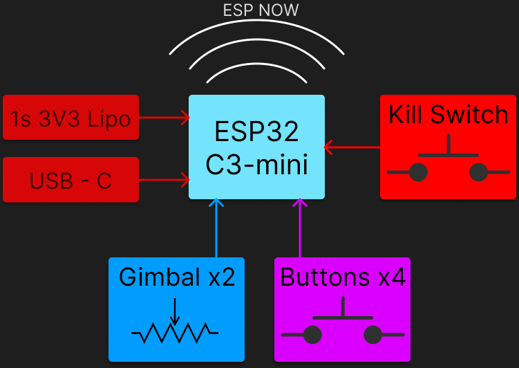
</div>

| Block | Part | Role |
|---|---|---|
| MCU / radio | Espressif ESP32-C3-Mini | ADC, GPIO, OLED, ESP-NOW @ 100 Hz |
| Gimbals | 2 × potentiometer (IDEAFLY MC6) | 4 analog axes: throttle, yaw, pitch, roll |
| Display | 0.96" 96×64 monochrome OLED (I²C) | Status / calibration feedback |
| Inputs | 4 push buttons + arm/disarm toggle | Toggle is a hardware safety interlock |

**Transmitter firmware** is a set of cooperating FreeRTOS tasks. The data path is: sample joystick ADCs at 100 Hz → first-order IIR filter (α = 0.15) → calibrated normalisation → ±3-count deadband → packetise with sequence number and microsecond timestamp → ESP-NOW transmit. A persistent NVS-backed calibration routine handles per-stick centre and travel. A critical safety rule forces throttle to zero before transmission whenever the arm switch is disengaged.

<div align="center">
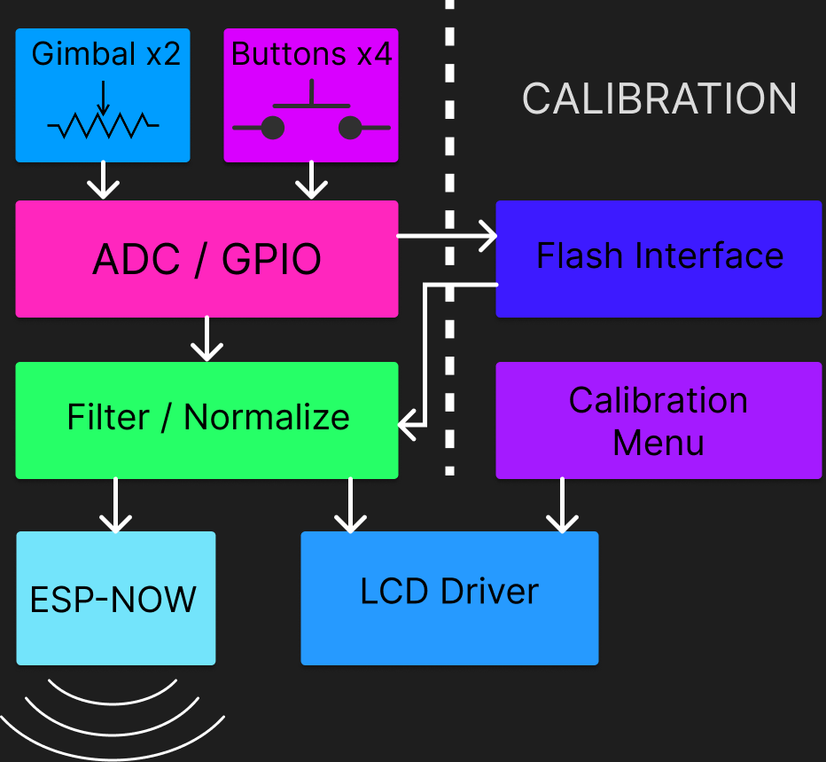
</div>

---

### 4. Wireless Link (ESP-NOW)

ESP-NOW was chosen because it is native to the ESP32 already present on the avionics board, meaning zero additional radio hardware on the drone. It provides a connectionless, peer-to-peer, 2.4 GHz transport with no router required.

The **receiver firmware** on the flight controller validates each packet (length, latency, sequence), maintains a clock-offset estimate from periodic sync packets for true end-to-end latency measurement, and runs a four-state **arming state machine**:

<div align="center">
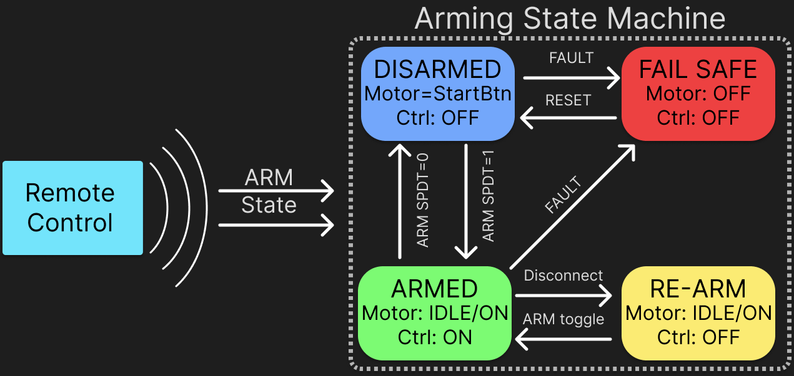
</div>

- **DISARMED** → **ARMED** only on a rising arm edge with throttle < 1 % for several consecutive packets (prevents arm-on-power-up).
- A heartbeat older than the failsafe timeout (≈ 1 s) forces **FAILSAFE** (motors off).
- Recovery is deliberately a two-step manual action (toggle off → **WAIT_FOR_REARM** → fresh rising edge with low throttle), so a briefly-lost-then-recovered link cannot spontaneously restart the motors.

Single-slot overwrite queues are used throughout so the PID always consumes the freshest setpoint and never a stale one.

---

### 5. Mechanical / Enclosure

3D-printed components supplement the PCB-as-frame architecture, modelled in SolidWorks / Fusion 360 and printed in PLA Pro and TPU.

- **Landing legs** — 4 × TPU; act as nonlinear springs absorbing landing/crash impact, individually replaceable.
- **Propeller guards** — 4 × PLA Pro rings on curved struts, tied by H-joints for torsional rigidity and flip-over protection; patterned compliant mounting base damps motor vibration.
- **Structural stackup** — at each corner: landing leg → ESC/airframe PCB → prop guard → motor, clamped by nylon screws (chosen to save weight and avoid shorting traces). The FC/ESC stack is soft-mounted on rubber dampeners, roughly doubling IMU stability vs. a hard-mounted iteration.
- **Handheld controller** — two-piece PLA Pro ergonomic shell.
<div align="center">
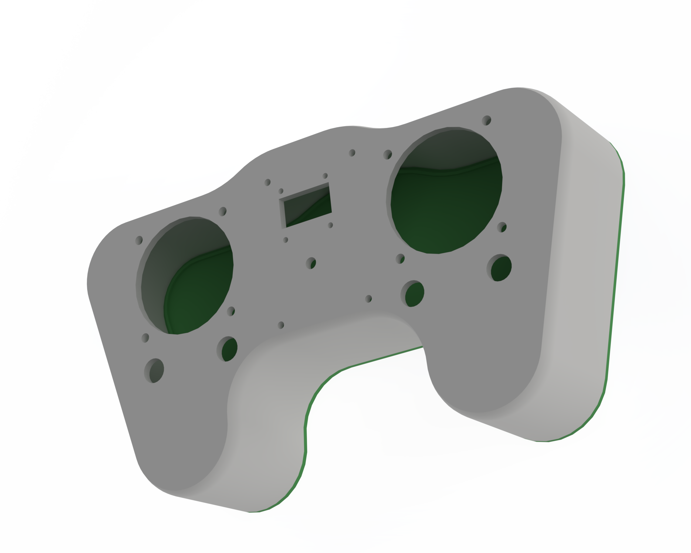
</div>

> **Build & safety note.** All parts were printed on a team member's personal 3D printer, and the boards were hand-soldered with fine-pitch components. 3D-printing PLA/TPU and soldering both release fumes that should not be inhaled at close range; print and solder in a ventilated space and use a fume extractor where possible. As one team member put it during a long print-and-solder session: *"When I breathe in the plastic, my head hurts for some reason"* — Minh Do. Funny in hindsight, but a real reminder that ventilation matters on hardware builds.

---

## Engineering Analysis

**Component mass budget**

The itemised component budget below sums to **125 g**. The **as-built, as-flown mass is 145 g**; the additional ≈ 20 g is fasteners, board-to-board wiring, solder, connectors, and the vibration dampeners, which the component-level budget does not itemise. The 145 g figure is the one used for regulatory and performance assessment.

| Component | Qty | Unit (g) | Subtotal (g) |
|---|---|---|---|
| GAONENG 2S LiPo 1000 mAh 120C | 1 | 49 | 49 |
| YSIDO 1104 8600 kV motor | 4 | 6.75 | 27 |
| 5-blade 51 mm propeller | 4 | < 1 | 4 |
| Custom avionics board | 1 | 15 | 15 |
| Custom ESC board | 1 | 25 | 25 |
| 3D-printed parts | 1 | 5 | 5 |
| **Itemised subtotal** | | | **125** |
| Fasteners, wiring, solder, dampeners (not itemised) | | | ≈ 20 |
| **As-built total** | | | **145** |

**Thrust & control authority** — each motor produces ≈ 75 g at full throttle (≈ 300 g system thrust). Against the 145 g as-built mass that is a thrust-to-weight ratio of ≈ **2.3 : 1**, exceeding the 2 : 1 target. Hover requires ≈ 36 g/motor (≈ 48 % throttle), leaving ample headroom for attitude correction and disturbance rejection.

**Why these choices** — the 10 cm × 10 cm board footprint was driven by JLCPCB cost breakpoints; the 250 g ceiling by Transport Canada's registration-exemption threshold. Flight control output is standard 1000–2000 µs PWM at 50 Hz, appropriate for a mechanically slow-reacting platform.

---

## Testing & Results

From acceptance testing and bench/flight validation:

- **20 / 24 tests passed.** 6 UWB tests were descoped (subsystem removed); 2 tests not attempted (bare-PCB hover withheld for safety; add-on module hover not formally tested).
- **1 documented fail:** peak full-throttle current (~18 A) exceeds the 15 A constraint; this is a transient only. Hover current (10.4–12 A) is within spec and BEMF commutation efficiency is near-optimal.
- **Weight:** 145 g as built and flown, 42 % under the 250 g limit (the itemised component budget accounts for 125 g; see [Engineering Analysis](#engineering-analysis)).
- **Thrust-to-weight:** ≈ 2.3 : 1, exceeding the 2 : 1 target.
- **ESP-NOW:** ≈ 3 % packet loss at 10 m with no consecutive drops; usable range > 20 m.
- **Endurance:** ≈ 5.5 min hover, nearly 3× the 2 min requirement.
- **Custom ESC:** all bench and flight tests passed; outperformed the commercial off-the-shelf ESC used as an early stand-in.
- **PID:** confirmed 1 kHz loop; stable manual hover achieved on the final hardware.

The prototype passes acceptance testing: the drone hovers, communicates, and stabilises as designed.

<div align="center">
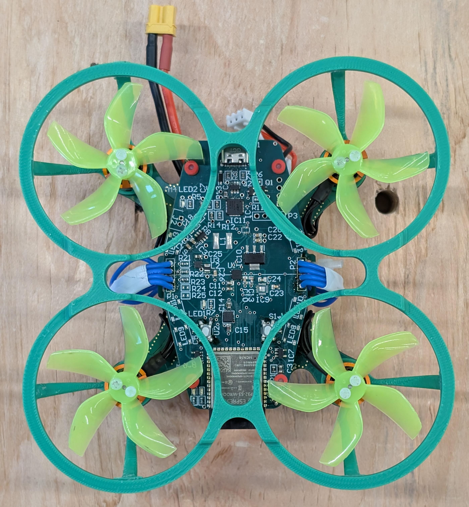
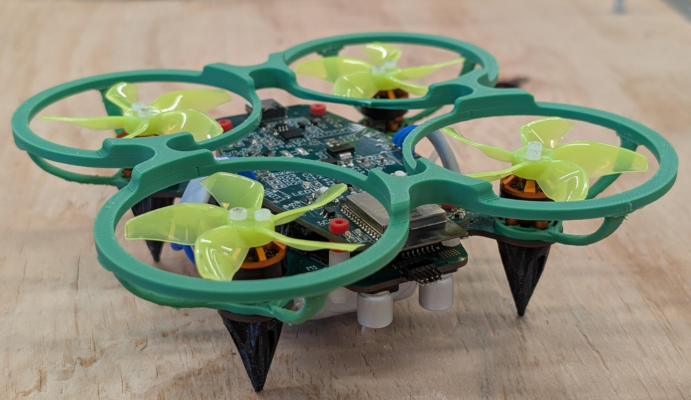
</div>

---

## Bill of Materials

Summary across the three custom boards (full per-line BOM is in the design specification, Appendix III):

| Board | Unique line items | Total components | Cost (CAD) |
|---|---|---|---|
| ESC / Airframe | 41 | 210 | \$119.06 |
| Avionics / Flight Controller | 42 | 80 | \$52.83 |
| Handheld Controller | 37 | 61 | \$28.44 |
| **Total** | — | **351** | **\$200.33** |

These are board-level component costs. Total project R&D spend including PCBA service, COTS flight hardware, spares, shipping, and duties was ≈ \$2,200 against a \$1,020 plan, under the \$2,500 out-of-pocket cap (≈ \$367/member, within the \$417 cap).

---

## Design Alternatives Considered

| Decision | Chosen | Alternatives & rationale |
|---|---|---|
| Control strategy | Cascaded PID | LQR/MPC rejected: require accurate plant model / too costly on the ESP32-S3; PID is well-understood, ~20 µs/cycle, no analytical model needed |
| ESC | Custom design | COTS rejected to meet course objectives and retain commutation control; custom ESC ultimately outperformed the COTS stand-in |
| ESC MCU | STM32F405 | ESP32 lacks deterministic timer/ADC peripherals for real-time commutation; ST reference library reduced risk |
| Commutation | Sensorless BEMF | Hall-sensored rejected: COTS motors lack hall sensors; fewer wires/failure points; open-loop startup accepted as trade-off |
| Flight controller | Custom | Betaflight/INAV rejected for course design requirements; trade-off is a less mature stack |
| Wireless | ESP-NOW | CRSF/SBUS/custom RF rejected: ESP-NOW needs zero extra hardware; trade-off is less proven, no built-in RSSI/hopping |
| Airframe | PCB-as-frame | Traditional frame rejected: PCB-frame removes harness and weight; trade-offs are lower impact tolerance and geometric constraints |

---

## Regulatory Considerations

The following would apply if the platform were commercialised in Canada (full discussion in the design specification, Section 8):

- **Transport Canada CARs Part IX** — sub-250 g recreational operation in uncontrolled airspace is exempt from registration/certification, but altitude (122 m AGL), no-fly-zone, and visual-line-of-sight rules still apply.
- **ISED RSS-247 / RSS-Gen** — 2.4 GHz licence-exempt limits; the Espressif modules carry pre-existing ISED certification.
- **ISED ICES-003 / FCC Part 15** — EMC limits for the digital circuitry; testing required for a commercial product.
- **IEC 62368-1**, **RoHS (2011/65/EU)**, **UN 38.3 / IATA** (battery transport) — product safety, hazardous-substance, and lithium-battery shipping standards.

---

## Future Work

- **UWB indoor positioning** — reintegrate the descoped Qorvo DWM3000 ranging subsystem for autonomous station-keeping.
- **Payload module** — standardised mechanical/electrical expansion interface and a representative payload.
- **Regulatory path** — formal EMC pre-compliance and a certification route (CSA/CE).
- **Manufacturing optimisation** — consolidate subsystems onto fewer boards; DFM and volume BOM.
- **Autonomous flight** — add altitude sensing and position hold; upgrade the Mahony filter to an EKF. The cascaded architecture is designed to accept setpoints from an autonomous position controller in place of the pilot's sticks with minimal firmware change.

---

## Team

**Specific Dynamics — Hood Research Department** (ENEL 400, Group 16)

| Member | Primary responsibility |
|---|---|
| Khai Huynh | Motor & brushless controller (ESC) |
| Vikram Procter | Motor & brushless controller (ESC) |
| Minh Do | PID motor control loop; handheld controller PCB |
| Caleb Garcia | PID motor control loop |
| Chloe Fulbrook | Wireless radio control |
| Ethan Sam | Wireless radio control; handheld controller schematic |

<div align="center">

</div>

---

## Acknowledgements

The team thanks Drs. Yani Jazayeri and Denis Onen, teaching assistants Ben Pele and Devin Atkin, and the ENEL 400 lab technicians for their support, and Gauthier Appaix for his contributions to the 3D and mechanical designs.

**AI tool use disclosure.** Anthropic's Claude (web chat and Claude Code) was used for firmware debugging, code comprehension and review, datasheet interpretation, and technical research. No firmware modules were generated wholesale; all source code was written by team members, and all AI-assisted output was manually reviewed and cross-checked against datasheets, reference manuals, and bench testing before inclusion in any deliverable.

---

## References

The complete design specification, schematics, PCB layouts, full bill of materials, prototype photographs, 3D drawings, and schedule/expenditure variance are in [`docs/Design_Specification.pdf`](docs/Design_Specification.pdf). Key external references include the STMicroelectronics STSW-SPIN3204 6-step sensorless reference library, the STM32F4 reference manual (RM0090), the Espressif ESP-IDF documentation and ESP-NOW user guide, the DRV8329 / CSD17581Q5A / TPS563209 / ICM-40609-D / MMC5983MA datasheets, R. Mahony et al. (2008) on nonlinear complementary filters, and Ziegler & Nichols (1942) on automatic controller tuning. Full citations appear in Section 11 of the design specification.

---

<div align="center">
<sub>Specific Dynamics — A Higher Purpose · F-17 Humanitarian Hummingbird · 2026</sub>
</div>
